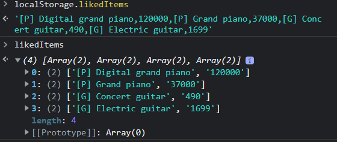

# Website may be visited <a href='https://jspoh.github.io/projects/demo-websites/e-commerce/products.html'>here</a>

Note: This website taps into your localStorage. You may enter 'localStorage.clear()' in the console to delete the stored data.

Resources used may be referenced <a href='https://jspoh.github.io/projects/demo-websites/e-commerce/credits.html'>here</a>

## Please start off with the products.html file

This is the main landing page. The user may scroll/use arrow keys to snap to the next section.
 

When hovering over the category tab, a pop-up menu will appear - prompting the user to select a type of item to view. This screenshot shows the page when the guitar product option is selected.

The white heart will turn red when clicked on and will add the related item to the liked items list. The cart with a plus sign will add the item selected into the user's cart when clicked on while changing the plus sign to a cross. The cart with the cross sign can be clicked on to remove the item from cart.

On hover, the product card will expand and show more information for a quick overview as shown on the leftmost product card. I did not build individual pages for the products.

 

This page consolidates the user's liked items. The user may click on any of the listed items to go back to the product page to view the item in order to remove it from liked items or to add to cart.

 

          
This page consolidates the user's cart items and also allows the user to checkout their cart. All fields must be filled and the cart must not be empty in order to check out successfully.

 

Upon checking out, this modal will pop up to give the user a summary. A version will be logged in the console as well.

The user's cart information will be wiped upon checking out successfully.

 

All liked/cart items are saved to the localStorage so that the data may survive page refreshes and even the os rebooting. The user will have to enter localStorage.clear() into the console or clear their browser's memory to delete this data.

In the event where the localStorage data is not cleared, this website will always show the most updated liked items list and products in cart.
